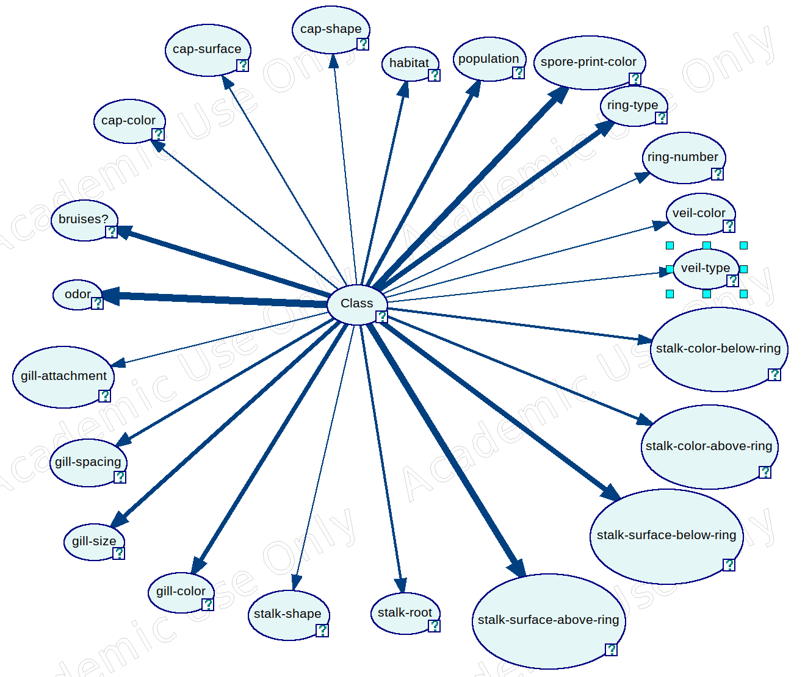
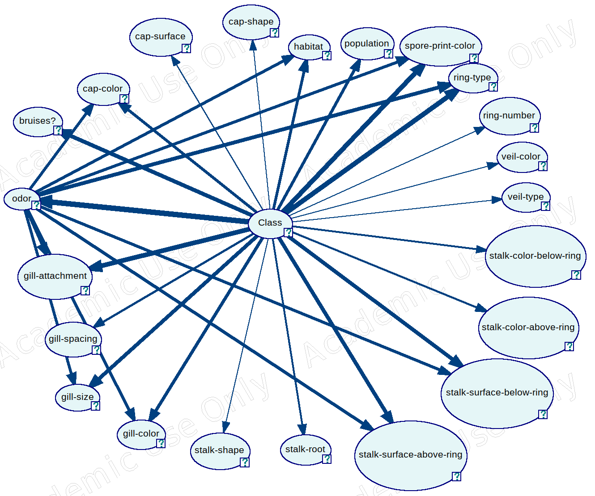

# SE-AGH: Project #2

This repository contains a Bayesian network project for the Expert Systems course at AGH University of Science and Technology (2020/2021).

The knowledge used by the system is based on the [Mushroom dataset](https://archive.ics.uci.edu/ml/datasets/mushroom) from the UCI Machine Learning Repository.

## Installation guide

### Requirements

This code was tested using Python 3.6.9, but presumably it should also work with other 3.x versions. Additionally, a [SMILE](https://www.bayesfusion.com/smile/) license is required. This README provides instructions for obtaining an academic license for those eligible, however a business license should also be appropriate.

### Setup

This project is based on a [GeNIe](https://www.bayesfusion.com/genie/) model and uses the [SMILE](https://www.bayesfusion.com/smile/) engine for inference.

You do not need to setup GeNIe, since the static model is already loaded into the project, however some setup is necessary for the SMILE library.

1. Install the required dependencies as per usual using the command `pip3 install -r requirements.txt`.
2. If you're eligible for an academic license, go to [SMILE's website](https://download.bayesfusion.com/files.html?category=Academia#SMILE) and download a zip with your access key. Unzip the file and copy the `pysmile_license.py` file into the root of the project. Otherwise, you can consult the [appropriate website](https://download.bayesfusion.com/files.html?category=Business) to inquire about obtaining a business license.

### Usage
Once you install all the dependencies, you can start the program by running the following command:

```bash
python3 model.py
```

**Note**: If you experience issues with the way the app scales on a high-DPI display, as a workaround you can try to play with the following environment variables:

```bash
export QT_AUTO_SCREEN_SCALE_FACTOR=1
export QT_SCALE_FACTOR=0.5
```

## Results

Two networks were created. The networks were tested with different thresholds for accepting answers as truth. 

For example, if we set the threshold to 95%, we could have three possible scenarios:
* **correct classification** - the mushroom is, let's say, edible and the network returns a 99.9% probability of it being edible (since 99.9 > 95.0),
* **incorrect classification** - the mushroom is edible, but the network returns the opposite class with a probability exceeding the threshold (for example a 99.8% probability of it being poisonous and a 0.2% probability of it being edible),
* **inconclusive classification** - the network returns some probabilities for both classes, but neither of them exceeds the threshold (like 55.5% for edible and 44.5% for poisonous).

### Basic network



| threshold | classified correctly | classified incorrectly | inconclusive results |
|-|-|-|-|
| 95% | 8084 | 3 | 37 |
| 99.991% | 7386 | 0 | 756

### Larger network



| threshold | classified correctly | classified incorrectly | inconclusive results |
|-|-|-|-|
| 95% | 8107 | 9 | 8 |
| 99.941% | 8085 | 0 | 39

## Bibliography

Dua, D. and Graff, C. (2019). UCI Machine Learning Repository [http://archive.ics.uci.edu/ml]. Irvine, CA: University of California, School of Information and Computer Science.
